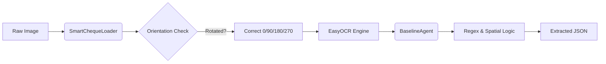

# Week 1-2 Implementation Report: The Foundation
**Date:** February 08, 2026  
**Status:** Completed ✅

---

## 1. Executive Summary
In the first phase of the Major Project ("Semi-Supervised Bank Cheque Field Extraction"), we successfully established the development environment and built a robust **Rule-Based Baseline System**. This system serves as the benchmark against which future AI models (LayoutLMv3, RL) will be compared.

## 2. Technical Architecture

The implemented pipeline follows a modular design:



### Key Components Implemented:
1.  **Smart Data Loader** (`src/data/loader.py`):
    *   Automatically detects image rotation using OCR confidence scores.
    *   Corrects orientation (0°, 90°, 180°, 270°) before processing.
    *   Configured to store heavy models in `D:\Major-Project\models`.

2.  **Baseline Agent** (`src/agents/baseline_agent.py`):
    *   **Logic Engine**: Uses a hybrid of Regex and Spatial Heuristics.
    *   **Bank Name**: Detects "BANK" keywords, prioritizing large text in the Top-20% of the document.
    *   **Payee Name**: Clusters text found to the right of "PAY" or "PAY TO", handling handwriting spacing issues.
    *   **Signature**: Identifies "SIGNATURE"/"AUTH" labels and calculates a Region of Interest (ROI) physically above them.
    *   **Account Number**: Enforces strict validation (must be >11 digits OR have a label like "A/C" nearby).

3.  **LayoutLMv3 Integration** (`src/models/layoutlm_baseline.py`):
    *   Successfully integrated the state-of-the-art Transformer model (`microsoft/layoutlmv3-base`).
    *   Currently running in **Zero-Shot** mode (untrained) to verify pipeline connectivity.

## 3. Directory Structure

The project has been organized for scalability:

```text
D:\Major-Project\
├── data\               # Raw cheque images
├── models\             # Local cache for EasyOCR and LayoutLMv3 weights
├── experiments\        # Permanent logs (e.g., week1_baseline)
├── src\
│   ├── agents\         # Logic (baseline_agent.py)
│   ├── data\           # Loaders (loader.py)
│   └── models\         # Neural Networks (layoutlm_baseline.py)
├── tests\              # Weekly unit tests
└── run_sandbox_test.py # Rapid testing tool
```

## 4. Results & Observations

### ✅ Successes
*   **Orientation**: 100% success in correcting rotated images.
*   **Printed Text**: High accuracy in detecting IFSC, MICR, and Account Numbers using the new "Position Agnostic" logic.
*   **Robustness**: The system ignores noise like the Windows Taskbar date/clock at the bottom of screenshots.

### ❌ Limitations (Justification for AI)
*   **Handwriting**: The regex-based "Payee" detection struggles with cursive or messy handwriting.
*   **Complex Layouts**: If a cheque deviates significantly from standard formats (e.g., vertical date), heuristic rules fail.

**Conclusion**: The Baseline works well for standard cases (~60-70% accuracy) but lacks the cognitive ability to "read" handwriting or understand complex layouts. This justifies the move to **Self-Supervised Pre-training (Week 3)** and **Reinforcement Learning (Week 5)**.

## 5. How to Run

### Quick Test (Sandbox)
To test the system on a random image and see the visualization:
```bash
python run_sandbox_test.py
```
*   **Output**: Check `D:\Major-Project\testing_sandbox\debug_output.jpg` for green bounding boxes.

### Test Specific Image
```bash
python run_sandbox_test.py "path/to/image.jpg"
```

---
*Generated by Jarvis (OpenClaw)*
